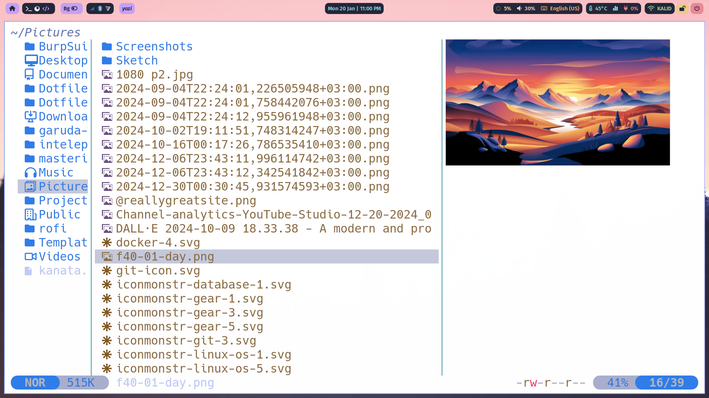
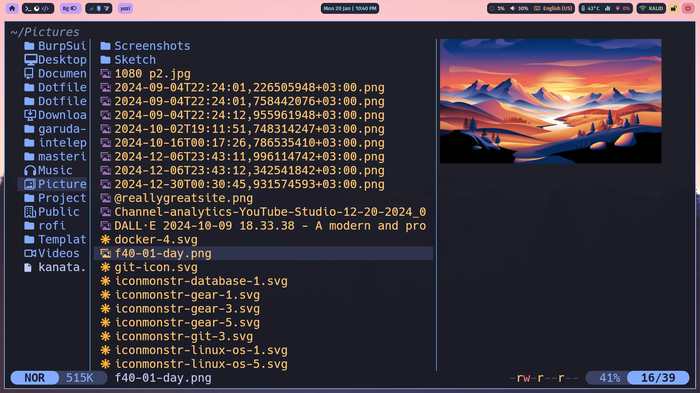

# Flavors

The "flavor" is a pre-made Yazi theme, introduced in Yazi v0.2.4, allowing users to update and expand their color schemes more conveniently.

See https://yazi-rs.github.io/docs/flavors/overview for details.

> [!TIP]
> If you've created a flavor for Yazi, please raise a PR to add your repo to the `README.md`.

## [tokyonight-day.yazi](./tokyonight-day.yazi)

## [tokyonight-moon.yazi](./tokyonight-moon.yazi)

## [tokyonight-night.yazi](./tokyonight-night.yazi)

## [tokyonight-storm.yazi](./tokyonight-storm.yazi)

## This project is inspired by [yazi-rs/flavors](https://github.com/yazi-rs/flavors)

  ## 💰 You can help me by Donating
     
